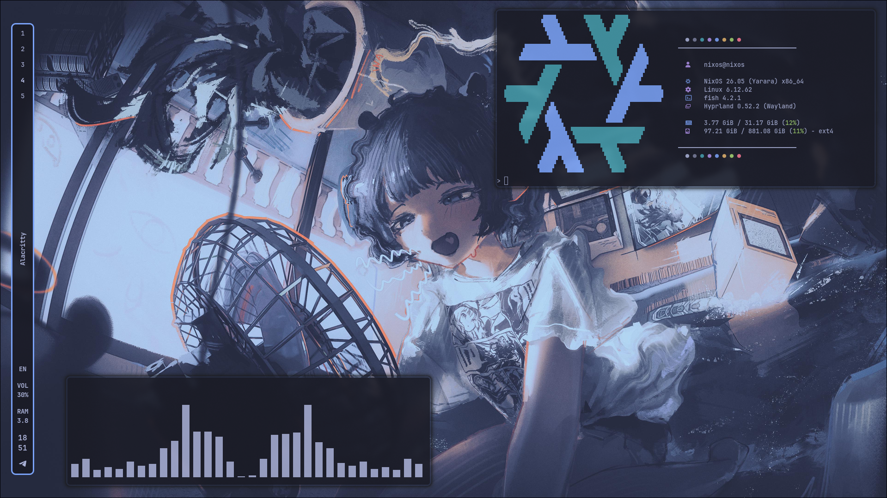
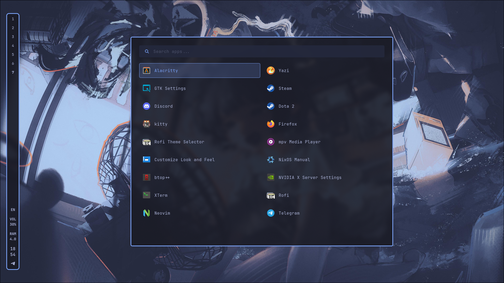
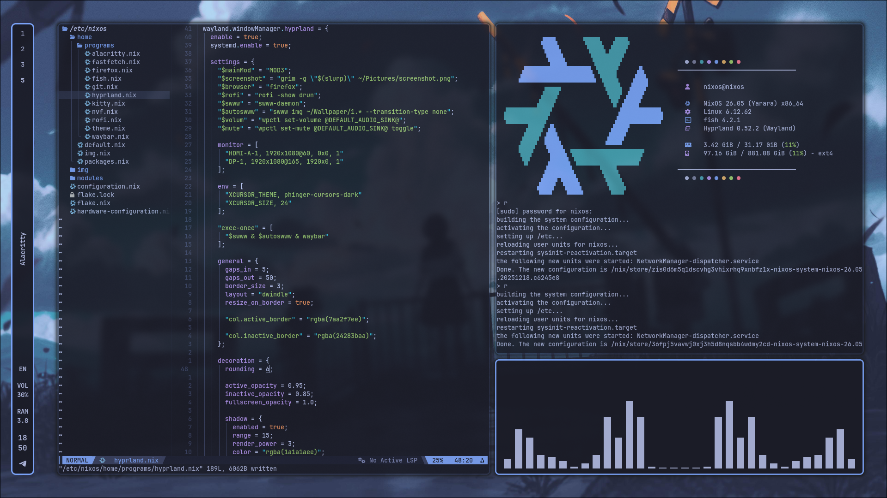
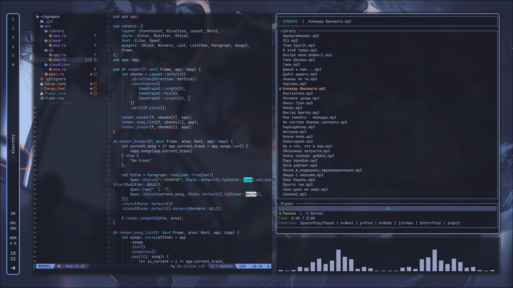

<div align="center">

# ❄️ [mains-hum] / nix-tokyonight
`Hello, I am mains-hum. Beautiful dotfile with gtk theme - tokyonight, NixOS Hyprland.`

<p align="center">
  
  
  
  
  
</p>

---
</div>

## 📸 Screenshot
<p align="center">
  
  
  <br />
  
  
</p>

---

## 🎯 Core Stack

| Component | Software |
| :--- | :--- |
| **Compositor** | `Hyprland` (Wayland) |
| **Shell** | `Fish` |
| **Terminal** | `Alacritty` |
| **Editor** | `Neovim` (NVF Framework) |
| **Bar** | `Waybar` |
| **Launcher** | `Rofi` |
| **File Manager** | `Yazi` |

---

## ⌨️ Navigation
| Keybind | Action | Keybind | Action |
| :--- | :--- | :--- | :--- |
| `Caps Lock + E/Ret` | Alacritty | `Caps Lock + Q` | Kill |
| `Caps Lock + R` | Rofi | `Caps Lock + F` | Fullscreen |
| `Caps Lock + S` | Yazi | `Caps Lock + W` | Firefox |
| `Caps Lock + Space` | Layout | `Alt + Shift + S` | Screenshot |
| `Caps Lock + D` | Telegram | `Caps Lock + A` | Steam |

---

## 📦 Installation

### Prerequisites

- Fresh NixOS installation
- Username: `nixos` **(recommended)**
- Basic understanding of Nix flakes

```bash
# Install git
> sudo nano /etc/nixos/configuration.nix
# Add to systemPackages: git
> sudo nixos-rebuild switch

# Clone this repository
> mkdir Pictures
> git clone https://github.com/mains-hum/nix-tokyonight.git
> cd nix-tokyonight/nixos

# Copy configuration files
> sudo rm -rf /etc/nixos/configuration.nix
> sudo cp -a home/ img/ modules/ configuration.nix flake.lock flake.nix /etc/nixos

# Rebuild
> sudo nixos-rebuild switch --flake /etc/nixos#nixos

# Reboot your system
> reboot
```

---

### ⚠️ Important Notes

- Configure your monitor in Hyprland:

```bash
> snvf /etc/nixos/dotfiles/hypr/hyprland.conf
```

```conf
monitor = DP-1, 1920x1080@165, 0x0, 1
# For multiple monitors:
# monitor = HDMI-A-1, 1920x1080@60, 1920x0, 1
```

-  Use username **`nixos`** for best compatibility
-  **Do not change** the layout switch from `ALT + SHIFT` (breaks keybindings)
-  For multiple monitors, add additional `monitor` lines
-  Convert wallpaper to gtk gtk theme
```bash
> gowall convert ~/path-to-wallpaper -t tokyo-storm
```

---

<div align="center">
⭐ Star this repo if you find it helpful!
Made with by mains-hum
</div>

---

## 📝 License

nix-dotf  Copyright (C) 2025-2040  mains-hum

See the [LICENSE](LICENSE) file for details.

</div>
